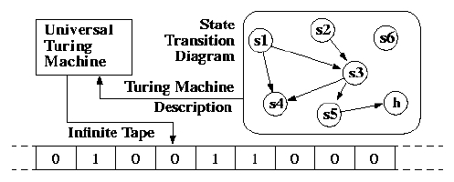

# Turing machine

This repository contains a simple implementation of a [Turing machine](https://en.wikipedia.org/wiki/Turing_machine) and a [finite state machine](https://en.wikipedia.org/wiki/Finite-state_machine) in Java.
This project was done for the course "Programmierpraktikum" in Fall 2019 at the University of Wuerzburg.

*Simple visualization of a turing machine - source: https://web.mit.edu/manoli/turing/www/turing.html* 